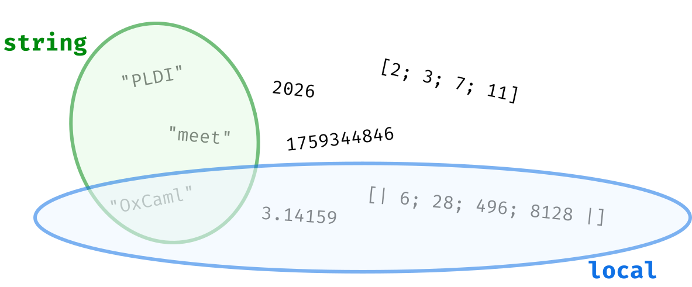

{.title}
# OxCaml: *safe control over program behavior* 

Gavin Gray, Anil Madhavapeddy, KC Sivaramkrishnan, Richard Eisenberg, Chris Casinghino,
Will Crichton, Shriram Krishnamurthi, Patrick Ferris, Max Slater, Megan Del Vecchio, Diana Kalinichenko, Nadia Razek

<div style="display: flex; justify-content: right; align-items: start; margin-top: 2em;">
  <em>While we get set up, tell us why you’re here!</em>

  
</div>

{pause up}

## OxCaml provides

*Safe control* over performance-critical aspects of program behavior, *in OCaml*

{pause}

- **Control:** over allocation and memory layout

{pause}

- **Safe:** data-race freedom, memory safety

{pause}

- **in OCaml:** OxCaml is a superset of OCaml, so every OCaml program is a valid OxCaml program

{pause up}

# Example 1: Safe Stack Allocation

```ocaml
let gensym =
  let count = ref 0 in
  fun () ->
    count := !count + 1;
    "gsym_" ^ (Int.to_string !count) 
```

{pause}

```ocaml
let perf_critical () = 
  let symbols = [| gensym (); gensym () |] in
  ...
```

{pause}

{.question .horizontal}
> {#memory-layout-correct}
> 
> 
> {#memory-layout-wrong}
> 

{pause exec}
```slip-script
let el = document.querySelector("#memory-layout-correct")
console.log(el)
slip.setClass(el, "correct", true)
el = document.querySelector("#memory-layout-wrong")
slip.setClass(el, "wrong", true)
```

{pause}

What “bad thing” could happen given these allocations? {pause} *garbage-collection cycle*

{pause center}

What does the compiler need to know/do to avoid these heap allocations?

{pause}

1. Escape analysis: does `symbols` escape this function region?

{pause}

2. Update the code to allocate the array on the stack

{pause up}

## OxCaml Escape Analysis

{pause}

```ocaml
let perf_critical () = 
  let symbols = [| gensym (); gensym () |] in
  ...
```

{pause}

```ocaml
let perf_critical () = 
  let symbols @ local = [| gensym (); gensym () |] in
  ...
```

{pause}

Every value is either `@ local` or `@ global`, the latter is the *OCaml default*

{pause}

A value is `@ local` if it doesn’t escape the current region

{pause}

A value `@ local` *could be stack allocated*

{pause up}

## OxCaml Stack Allocation

```ocaml
let perf_critical () = 
  let symbols @ local = [| gensym (); gensym () |] in
  ...
```

We assert that `symbols` is local and doesn’t escape the current region

*How can we ensure that it’s stack allocated?*

{pause}

OxCaml provides new keywords for allocation: `stack_` and `exclave_`

{pause}

### Using `stack_`

```ocaml
let perf_critical () = 
  let symbols @ local = stack_ [| gensym (); gensym () |] in
  ...
```

{pause}

This turns the allocation site for `[| |]` into a *stack allocation.*

{pause center}

#### The Local Region (“Stack Allocation”)

The local region is still dynamically sized, but not GC managed. It’s cleaned up on function exit

<div style="position: relative; display: grid; grid-template-columns: 1fr 1fr; gap: 1em;">

```ocaml
let perf_critical () = 
  let symbols  = stack_ 
    [| gensym (); gensym () |] in
  ...
```


```rust
fn perf_critical() {
  let arena = Arena::new();
  let symbols = 
    arena.alloc([gensym(), gensym()]);
  ...
}
```

</div>

{pause center}

{.question .vertical}
> {#memory-layout-local-correct}
> 
> 
> {#memory-layout-local-wrong}
> 

{pause exec}
```slip-script
let el = document.querySelector("#memory-layout-local-correct")
slip.setClass(el, "correct", true)
el = document.querySelector("#memory-layout-local-wrong")
slip.setClass(el, "wrong", true)
```

{pause center}

`stack_` controls the allocation *only* for the `[| |]`, `gensym` still allocates the strings on the heap!

{pause}

```ocaml
val gensym : unit -> string
```

{pause}

```ocaml
val gensym : unit -> string @ global
```

{pause}

Stack allocation requires cooperation from *all callees!*

{pause up}

### Using `exclave_`

We may want to use a helper function to create the array

{#stack-not-allocation-site}
```ocaml
let gensym_2 () = 
  [| gensym (); gensym () |]

let perf_critical () = 
  let symbols @ local = stack_ (gensym_2 ()) in
  ...
```

{pause exec}
```slip-script
let el = document.querySelector("#stack-not-allocation-site")
slip.setClass(el, "does-not-compile", true)
```

```
   |   let symbols @ local = stack_ (gensym_2 ()) in
                                    ^^^^^^^^^^^^^
Error: This expression is not an allocation site.
```

{pause}

{#stack-allocation-escapes}
```ocaml
let gensym_2 () = 
  stack_ [| gensym (); gensym () |]

let perf_critical () = 
  let symbols @ local = gensym_2 () in
  ...
```

{pause exec}
```slip-script
let el = document.querySelector("#stack-allocation-escapes")
slip.setClass(el, "does-not-compile", true)
```

<div style="display: grid; grid-template-columns: 1fr 1fr; gap: 1em; position: relative;">

```
stack_ [| gensym (); gensym () |]
^^^^^^^^^^^^^^^^^^^^^^^^^^^^^^^^^^
Error: This value escapes its region.
```

{pause down}
> 
>
> {.does-not-compile}
> ```rust
> fn gensym_2<'a>() -> &'a [String] {
>   let arena = Arena::new();
>   return arena.alloc(
>     [gensym(), gensym()]
>   );
> }
> ```

</div>

{pause center}

`stack_` allocates the array local to `gensym_2`, but we actually want it to be allocated local to `perf_critical`, *the caller.*

{pause up}

```ocaml
let gensym_2 () =
  exclave_ [| gensym (); gensym () |]
```

`exclave_` allocates the value in the caller’s local region

{pause}

{carousel #carousel-memory}
>> 
> {change-page=carousel-memory}
>> 

{pause}

<div style="display: grid; grid-template-columns: 1fr 1fr; gap: 0.5em">

{.does-not-compile}
```ocaml
let perf_critical () = 
  let (f, s) = stack_ 
    (gensym (), gensym ()) in  
  ...
  f  
```

{pause}
```ocaml
let genint =
  let count = ref 0 in
  fun () -> 
    count := !count + 1;
    !count

let perf_critical () =  
  let (f, s) = stack_ 
    (genint (), genint ()) in 
  ...
  f
```

</div>

{pause center}

Integers aren’t allocated, so there’s no meaningful difference between `int @ local` and `int @ global`

{pause up}

### `@zero_alloc`

You may want to know if your function is truly `zero_alloc`

{#zero-alloc-check}
```ocaml
let[@zero_alloc] gensym_n n =
  exclave_ Array.init n ~f:(fun _ -> gensym ())
```

{pause exec}
```slip-script
let el = document.querySelector("#zero-alloc-check")
slip.setClass(el, "does-not-compile", true)
```

```
   |   Array.init n ~f:(fun _ -> gensym ())
       ^^^^^^^^^^^^^^^^^^^^^^^^^^^^^^^^^^^^
Error: called function may allocate (external call to caml_make_vect)
```

`[@zero_alloc]` uses an abstract interpreter to check if the extent of your function performs zero allocations

{pause}

{#zero-alloc-check-2}
```ocaml
let[@zero_alloc] gensym_n n =
  exclave_ (Array.init[@alloc stack]) n ~f:(fun _ -> gensym ())
```

{pause exec}
```slip-script
let el = document.querySelector("#zero-alloc-check-2")
slip.setClass(el, "does-not-compile", true)
```

```
   |                   gensym ()   
                       ^^^^^^^^^
Error: called function may allocate
```

Making `gensym` zero alloc is left as an exercise

{pause up}

## OxCaml So Far

We’ve seen new keywords like `stack_` and `exclave_` that provide control over memory allocation

{pause}

We’ve also seen new annotations, like `@ local` and `@ global`

{pause}

Which can appear on let bindings

```ocaml
let perf_critical () = 
  let symbols @ local = gensym_2 () in
  ...
```

And in type signatures

```ocaml
val gensym_2 : unit -> string array @ local

val Array.init : int -> f:(int -> 'a) -> 'a array @ global
```

{pause}

`local` and `global` are instances of OxCaml *modes*

Modes are how how OxCaml provides *safety*

{pause up}

# A Conceptual Overview of Modes

{#values-container}


{pause exec}
```slip-script
let els = document.querySelectorAll(`#values-container [stroke="#008a0e"],#values-container [fill="#008a0e"]`);
console.debug("Showing", els);
els.forEach((el) => {
  slip.setClass(el, "visible", true)
});
```

{pause exec}
```slip-script
let els = document.querySelectorAll(`#values-container [stroke="#1071e5"],#values-container [fill="#1071e5"]`);
console.debug("Showing", els);
els.forEach((el) => {
  slip.setClass(el, "visible", true)
});
```

{pause}

{.definition title="What are Modes?"}
  **Modes are deep properties of values.** They refine how values of a type may be used - you can think of types as dividing the universe of values into different buckets, and modes capture cross-cutting properties (e.g., whether a value is stack allocated) that make sense for values of any type.

{pause center}

Example properties

- A value doesn’t escape the region

- A value is unique

{pause center}

- A function can be called from any domain (i.e., thread)

{pause center}

- A function can be invoked at most once

{pause center}

- *and many more ...*

{pause}

Modes provide safety to OxCaml: data-race freedom, and memory safety

{pause up}

## The Locality Axis

The locality axis has two modes: `local` and `global`

with a *submoding* relationship of `global < local`

<div style="display: grid; place-items: center;">

```ocaml
let gensym_2 (): string array @ global = 
  [| gensym (); gensym () |]

let perf_critical () = 
  let symbols @ local = gensym_2 () in
  (* Type checks because of submoding *)
  ...
```

| Mode | Property |
|------|--------------------------|
| `local` | Value doesn’t escape the region |
| **`global`** |  |

</div>

The `@ local` is a *mode annotation*

{pause}

Every mode axis has a default value for backwards compatibility with OCaml

The default for locality is the `global` mode. Default modes are bolded in the provided tables

{pause down .remark}
Modes are *inferred* by OxCaml, so allocations can be optimized to the stack without explicitly annotating with `stack_`.

{pause up}

### Mode Crossing: When Modes and Types Work Together

```ocaml
let genint =
  let count = ref 0 in
  fun () -> 
    count := !count + 1;
    !count

let perf_critical () =  
  let (f, s) = stack_ (genint (), genint ()) in 
  ...
  f
```

This works because integers *cross* locality

{pause}

Locality property: local values don’t escape the region

{pause}

In other words, *stack allocated* values don’t escape the region

{.theorem}
If a type upholds the properties of a mode axis, values of that type mode cross

{pause center}

#### But Some Integers are Local?

{#sig-plain}
```ocaml
let with_file : string -> (Unix.file_descr -> 'a) -> 'a
  = (* elided *)
```

{#sig-local .unstatic}
```ocaml
let with_file : string -> (Unix.file_descr @ local -> 'a) -> 'a
  = (* elided *)
```

{pause}

{#impl}
```ocaml
let open_file name =
  let stash = ref None in
  with_file name (fun fd -> stash := Some fd);
  Option.value_exn !stash
```

{pause static="sig-local" unstatic="sig-plain"}

{exec}
```slip-script
slip.setClass(document.querySelector("#impl"), "does-not-compile",
true)
```

{pause up}

# Example 2: Safe Parallelism

OCaml 5 introduced parallel programming with a multicore-aware runtime and effects

{pause}

**it also unleashed chaos:** race conditions, nondeterministic bugs, and hard-to-reason-about code.

{pause}

OxCaml introduces two mode axes for data-race freedom: contention and portability

{pause up}

## OCaml 5 introduced a new class of error: Data Races

{#unsafe-gensym-n}
```ocaml
module Par_array = Parallel.Arrays.Array

let gensym =
  let count = ref 0 in
  fun () ->
    count := !count + 1;
    "gsym_" ^ (Int.to_string !count)

let gensym_n par n =
  Par_array.init par n ~f:(fun _ -> gensym ())
```

What could happen if `gensym_n` is called with $n \geq 2$?

{pause exec}
```slip-script
let el = document.querySelector("#unsafe-gensym-n");
slip.setClass(el, "does-not-compile", true)
```

```text
Domain 1           Domain 2
---------------------------------
!count (0)         
---------------------------------
                   !count (0)
---------------------------------
count := 0 + 1     
---------------------------------
                   count := 0 + 1
---------------------------------
!count (1)         
---------------------------------
                   !count (1)
```

Resulting array: `[| "gsym_1"; "gsym_1" |]` Duplicate symbols? Unexpected!

{pause center}

It is *unsafe* to run `gensym` on multiple domains, we want to statically prevent this from happening

{pause}

The code does not compile in OxCaml, but does in OCaml

{pause up}

### Data races require 4 ingredients

1. **Parallel execution** - Code running in different parallel domains (read, threads)
2. **Shared memory** - A location accessible by multiple domains
3. **At least one write** - One domain is modifying the data
4. **No synchronization** - No atomics, etc

{pause}

```ocaml
let gensym = 
  let count = ref 0 in (* (2) shared memory *)
  (*          ^^^^^                  
     (4) bare ref: no synchronization *)
  fun () -> 
    count := !count + 1; (* (3) a write *)
    "gsym_" ^ (Int.to_string !count)

let gen_many par n = 
  (* (1) parallel execution, when n > 1 *)
  Par_array.init par n ~f:(fun _ -> gensym ())
```

{pause center}

The lambda `(fun _ -> gensym ())` must be safe to share across domains

{pause}

The function `gensym` must also be safe to share across domains

{pause}

`gensym` closes over a non-synchronized mutable reference, and *reads* and *writes* to it

{pause}

Therefore, `gensym` is not safe to share across domains

`(fun _ -> gensym ())` is not safe to share across domains

{pause up}

## Modes for Safe Parallelism

There are two key mode axes for expressing parallelism constraints

{pause}

{#contention-portability-container}
> {.port-area}
> > ### Portability<span class="subtitle">: Is this value (function) safe to share across domains?</span>
> >
> > <div style="display: grid; place-items: center;">
> >
> > `portable < nonportable`
> >
> >
> > | Mode  | Property |
> > |------|--------------------------|
> > | **`nonportable`** | Value isn’t shared across domains |
> > | `portable` |  |
> >
> > </div>
> >
> > {pause-block #gensym-par-array-aside}
> > > {.does-not-compile}
> > > ```ocaml
> > > let gensym @ portable = 
> > >   let count = ref 0 in
> > >   fun () -> 
> > >     count := !count + 1;
> > >     "gsym_" ^ (Int.to_string !count)
> > >
> > > let gen_many par n = 
> > >   Par_array.init par n ~f:(fun _ -> gensym ())
> > > ```
> > > {pause}
> > > ```ocaml
> > > val Par_array.init : Parallel_kernel.t -> int 
> > >   -> f:(int -> 'a @ portable) @ portable (* <-- *)
> > >   -> Par_array.t
> > > ```
> >
> > {pause exec}
> > ```slip-script
> > let el = document.querySelector("#gensym-par-array-aside")
> > slip.setStyle(el, "display", "none")
> > ```
> >
> {.cont-area}
> > ### Contention<span class="subtitle">: What access do I have to this shared memory?</span>
> >
> > <div style="display: grid; place-items: center;">
> >
> > `uncontended < shared < contended`
> >
> > | Mode | Property |
> > |------|--------------------------|
> > | `contended` | Value isn’t read or written |
> > | `shared` | Value isn’t written |
> > | **`uncontended`** | |
> > </div>

{pause exec}
```slip-script
let el = document.querySelector("#contention-portability-container")
slip.setClass(el, "cont-port-container", true)
```

{pause}

{.corollary}
References captured by portable functions are `contended`

<div style="display: grid; grid-template-columns: 1fr 1fr; gap: 1em; align-items: start;">

{#gensym-par-array-code}
```ocaml
let gensym @ portable = 
  let count = ref 0 in
  fun () -> 
    count := !count + 1;
    "gsym_" ^ (Int.to_string !count)
```

{pause exec}
```slip-script
let el = document.querySelector("#gensym-par-array-code")
slip.setClass(el, "does-not-compile", true)
```

```
  count := !count + 1;
  ^^^^^
Error: This value is contended but 
expected to be uncontended.
```

</div>

{pause up}

## Safely Working with Mutable State

Sometimes we actually need shared mutable state, OxCaml provides two types:

1. **Atomics** for simple operations
2. **Capsules** atomizing complex operations

{pause}

### Atomics

```ocaml
let gensym @ portable = 
  let count = Atomic.make 0 in 
  fun () -> 
    let n = Atomic.fetch_and_add count 1 in 
    "gsym_" ^ (Int.to_string n)
```

{pause}

*Why is using `Atomic` safe but `ref` was not? Why does this code type check?*

{pause}

`Atomic.t` provides synchronization, therefore it **crosses portability and contention**

{pause}

```ocaml
let make_gensym ?(prefix = "gsym_") () = 
  let count = Atomic.make 0 in 
  fun () -> 
    let n = Atomic.fetch_and_add count 1 in 
    prefix ^ (Int.to_string n)
```

{pause}

Can’t race on immutable types, they cross contention

{pause center}

What if `fetch_and_add` didn’t exist?

```ocaml
let gensym @ portable =
  let count = Atomic.make 0 in
  fun () ->
    Atomic.incr count;
    let n = Atomic.get count in
    "gsym_" ^ (Int.to_string n)
```

{pause}

Atomics prevent data races, *but not race conditions.* What we need is for the read and write to be a single atomic operation

{pause up}

### Capsules

If the `Atomic.fetch_and_add` function didn’t exist, could we still write `gensym`?

{pause}

{.definition title="Capsules" #capsules}
Associate mutable state with locks, ensuring exclusive access. Capsules use the type system to track which values have access.

{pause #capsules}

```ocaml
let gensym =
  (* Create a capsule guarded by a mutex and unpack to get the brand. *)
  let (P mutex) = Capsule.Mutex.create () in

  (* Create encapsulated data bound to the same key brand. *)
  let counter = Capsule.Data.create (fun () -> ref 0) in

  (* Access the data, requiring a capability to wait/block. *)
  let fetch_and_incr (w : Await.t) =
    Capsule.Mutex.with_lock w mutex ~f:(fun access ->
      let c = Capsule.Data.unwrap ~access counter in
      c := !c + 1; !c)
  in
  fun w -> "gsym_" ^ Int.to_string (fetch_and_incr w)
```

{pause up}

# Activity!

We’ve prepared a short activity to help you gauge your understanding of OxCaml

<div style="display:flex; align-items: center; justify-content: center;">
  <figure style="text-align: center;">
    
    <figcaption><a href="https://tinyurl.com/oxcaml-wrkshp-activity"><code>tinyurl.com/oxcaml-wrkshp-activity</code></a></figcaption>
  </figure>
</div>

{pause up}

# OxCaml Summary 

{.remark title="Continue learning with ..."}
> Programming activities: [`github.com/oxcaml/tutorial-icfp25`](https://github.com/oxcaml/tutorial-icfp25)
>
> Documentation: [`oxcaml.org/documentation/`](https://oxcaml.org/documentation/)

OxCaml provides *safe control* over performance-critical aspects of program behavior

- New keywords (e.g., `stack_` and `exclave_`) provide control over memory

- Modes provide the *safety:* for memory and parallelism

<div style="display: flex; flex-direction: row; gap: 0.25em; flex-wrap: wrap; font-size: 0.95em;">

```ocaml
let gensym_n par n =
  Par_array.init par n 
    ~f:(fun _ -> gensym ())
                 ^^^^^^
Error: The value gensym is nonportable, 
  so cannot be used inside a function 
  that is portable.
```

```ocaml
let[@zero_alloc] gensym_n n = exclave_ 
  (Array.init[@alloc stack]) 
    n ~f:(fun _ -> gensym ())

let perf_critical () = 
  let symbols @ local = gensym_2 () in
  ...
```

</div>
